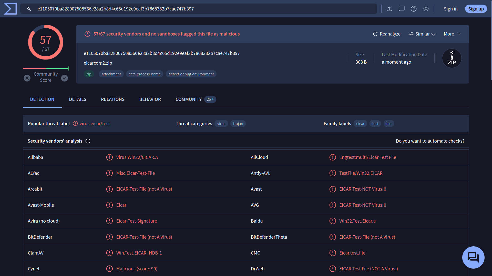

# 🛡️ Hacking Ético: Introducción

## 🔎 Introducción

Una búsqueda rápida en Google de "aprender ciberseguridad" arrojó alrededor de 600 millones de resultados, mientras que una búsqueda de "aprender hacking" arrojó más del doble. Es posible que la cifra haya aumentado aún más al recorrer esta sala.

Estamos rodeados de información. ¿Prefieres rendirte ante la sobrecarga de información y aceptar los primeros resultados? ¿O prefieres adquirir las habilidades de búsqueda necesarias para encontrar y acceder a lo que buscas? Esta sala te ayudará con esto último.

Objetivos de aprendizaje
El objetivo de esta sala es enseñar:

Evaluar las fuentes de información
Usar los motores de búsqueda eficientemente
Explorar motores de búsqueda especializados
Leer documentación técnica
Usar las redes sociales
Consultar los medios de comunicación

## 🔎 Evaluación de Resultados de Búsqueda

En Internet, todos pueden publicar sus escritos. Puede ser en forma de publicaciones de blog, artículos o publicaciones en redes sociales. Puede ser incluso de maneras más sutiles, como editando una página wiki pública. Esta capacidad hace posible que cualquiera pueda expresar sus afirmaciones infundadas. Todos pueden expresar su opinión sobre las mejores prácticas de seguridad cibernética, las tendencias futuras de programación y cómo prepararse mejor para una DevSecOps entrevista.

Es nuestro trabajo, como lectores, evaluar la información. Mencionaremos algunas cosas a considerar al evaluar la información:

Fuente: Identificar al autor u organización que publica la información. Considere si son de buena reputación y autoritativos sobre el tema. Publicar una publicación de blog no hace de una autoridad sobre el tema.
Evidencia y razonamiento: Verifique si las afirmaciones están respaldadas por evidencia creíble y razonamiento lógico. Estamos buscando hechos concretos y argumentos sólidos.
Objetividad y sesgo: Evaluar si la información se presenta de manera imparcial y racional, reflejando múltiples perspectivas. No estamos interesados en que los autores impulsen agendas sombrías, ya sea para promocionar un producto o atacar a un rival.
Corroboración y consistencia: Validar la información presentada por corroboración de múltiples fuentes independientes. Compruebe si múltiples fuentes confiables y de buena reputación están de acuerdo en las reclamaciones centrales.

## 🔎 Motores de búsqueda

Cada uno de nosotros ha utilizado un motor de búsqueda en Internet; sin embargo, no todos han tratado de aprovechar todo el poder de un motor de búsqueda en Internet. Casi todos los motores de búsqueda en Internet le permiten realizar búsquedas avanzadas. Considere los siguientes ejemplos:

Google
Bing
PatoDuckGo
Consideremos los operadores de búsqueda compatibles con Google.

"exact phrase": Las comillas dobles indican que está buscando páginas con la palabra o frase exacta. Por ejemplo, uno podría buscar "passive reconnaissance" para obtener páginas con esta frase exacta.
site:: Este operador le permite especificar el nombre de dominio al que desea limitar su búsqueda. Por ejemplo, podemos buscar historias de éxito en TryHackMe usando site:tryhackme.com success stories.
-: El signo menos le permite omitir los resultados de búsqueda que contienen una palabra o frase en particular. Por ejemplo, es posible que esté interesado en aprender sobre las pirámides, pero no desea ver sitios web de turismo; un enfoque es buscar pyramids -tourism o -tourism pyramids.
filetype:: Este operador de búsqueda es indispensable para encontrar archivos en lugar de páginas web. Algunos de los tipos de archivos que puede buscar usando Google son Portable Document Format (PDF), Microsoft Word Document (DOC), Microsoft Excel Spreadsheet (XLS) y Microsoft PowerPoint Presentation (PPT). Por ejemplo, para encontrar presentaciones de seguridad cibernética, intente buscar filetype:ppt cyber security.
Puede verificar controles más avanzados en varios motores de búsqueda en esto lista de operadores de búsqueda avanzada; sin embargo, lo anterior proporciona un buen punto de partida. Compruebe su motor de búsqueda favorito para los operadores de búsqueda compatibles.

## 🔎 Motores de búsqueda especializados

Está familiarizado con los motores de búsqueda en Internet; sin embargo, ¿cuánto está familiarizado con los motores de búsqueda especializados? Con eso, nos referimos a los motores de búsqueda utilizados para encontrar tipos específicos de resultados.

### Shodan
Empecemos con Shodan, un motor de búsqueda para dispositivos conectados a Internet. Le permite buscar tipos y versiones específicas de servidores, equipos de red, sistemas de control industrial y IoT dispositivos. Es posible que desee ver cuántos servidores aún se están ejecutando Apache 2.4.1 y la distribución entre países. Para encontrar la respuesta, podemos buscar apache 2.4.1, que devolverá la lista de servidores con la cadena “apache 2.4.1” en sus encabezados.

### Censys
A primera vista, Censys parece similar a Shodan. Sin embargo, Shodan se enfoca en dispositivos y sistemas conectados a Internet, como servidores, enrutadores, cámaras web y IoT dispositivos. Censys, por otro lado, se centra en hosts conectados a Internet, sitios web, certificados y otros activos de Internet. Algunos de sus casos de uso incluyen enumerar dominios en uso, auditar puertos y servicios abiertos y descubrir activos deshonestos dentro de una red. Es posible que desee verificar Casos de Uso Introductorio de Censys.

### VirusTotal
VirusTotal es un sitio web en línea que proporciona un servicio de escaneo de virus para archivos que utilizan múltiples motores antivirus. Permite a los usuarios cargar archivos o proporcionar URL para escanearlos contra numerosos motores antivirus y escáneres de sitios web en una sola operación. Incluso pueden ingresar hashes de archivos para verificar los resultados de los archivos cargados anteriormente.

La siguiente captura de pantalla muestra el resultado de verificar el archivo enviado contra 67 motores antivirus. Además, uno puede verificar los comentarios de la comunidad para obtener más información. Ocasionalmente, un archivo puede ser marcado como un virus o un troyano; sin embargo, esto podría no ser exacto por varias razones, y ahí es cuando los miembros de la comunidad pueden proporcionar una explicación más detallada.
